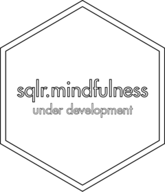

<!-- README.md is generated from README.Rmd. Please edit that file -->

# sqlr.mindfulness <a href='https://gipsousp.github.io/sqlr.mindfulness'></a>

<!-- badges: start -->

[](https://www.repostatus.org/#wip)
[](https://lifecycle.r-lib.org/articles/stages.html#experimental)
[](https://github.com/gipsousp/sqlr.mindfulness/actions)
[](https://codecov.io/gh/gipsousp/sqlr.mindfulness?branch=master)
[](https://choosealicense.com/licenses/mit/)
<!-- badges: end -->

`sqlr.mindfulness` is an R package with the research compendium of the
project: sleep and mindfulness: a systematic quantitative literature
review. The aim of `sqlr.mindfulness` is to facilitate the research
work, in addition to contributing to the reproducibility of the
research.

The assemble of this package was inspired by Ben Marwick, Carl Boettiger
& Lincoln Mullen article [“Packaging Data Analytical Work Reproducibly
Using R (and Friends)”](https://doi.org/10.1080/00031305.2017.1375986).

Learn more about Systematic Quantitative Literature Reviews at
<http://bit.ly/2OMxvcD>.

## Installation

`sqlr.mindfulness` is still at the
[experimental](https://lifecycle.r-lib.org/articles/stages.html#experimental)
stage of development, that means that people can use the package and
provide feedback, but it comes with no promises for long term stability.

You can install `sqlr.mindfulness` from GitHub with:

``` r
# install.packages("sqlr.mindfulness")
devtools::install_github("gipsousp/sqlr.mindfulness", dependencies = TRUE)
```

## Citation

If you use `sqlr.mindfulness` in your research, please consider citing
it. We put a lot of work to build and maintain a free and open-source R
package. You can find the `sqlr.mindfulness` citation below.

``` r
citation("sqlr.mindfulness")
#> 
#> To cite sqlr.mindfulness in publications use:
#> 
#>   Sales, L. V., Vartanian, D., Benedito-Silva, A. A., Pedrazzoli, M.
#>   (2021). sqlr.mindfulness: an R package with the research compendium
#>   of the project: sleep and mindfulness: a systematic quantitative
#>   literature review. Retrieved from
#>   https://gipsousp.github.io/sqlr.mindfulness/.
#> 
#> A BibTeX entry for LaTeX users is
#> 
#>   @Unpublished{,
#>     title = {sqlr.mindfulness: an R package with the research compendium of the project: sleep and mindfulness: a systematic quantitative literature review},
#>     author = {Leticia Viana Sales and Daniel Vartanian and Ana Amelia Benedito-Silva and Mario Pedrazzoli},
#>     year = {2021},
#>     url = {https://gipsousp.github.io/sqlr.mindfulness/},
#>     note = {Lifecycle: experimental},
#>   }
```
